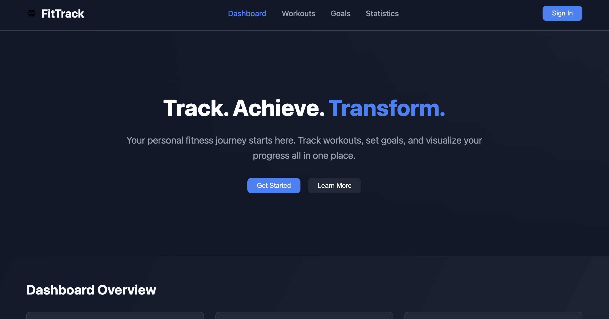
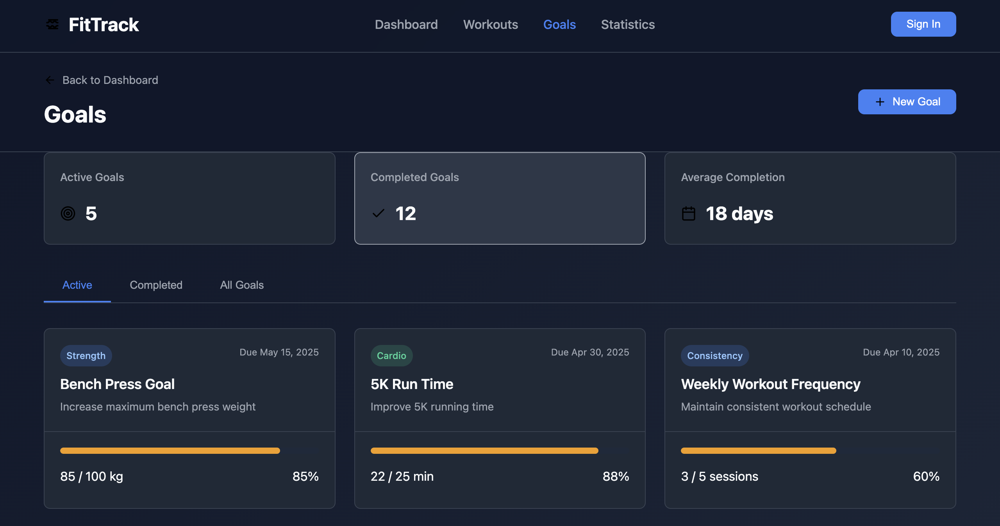
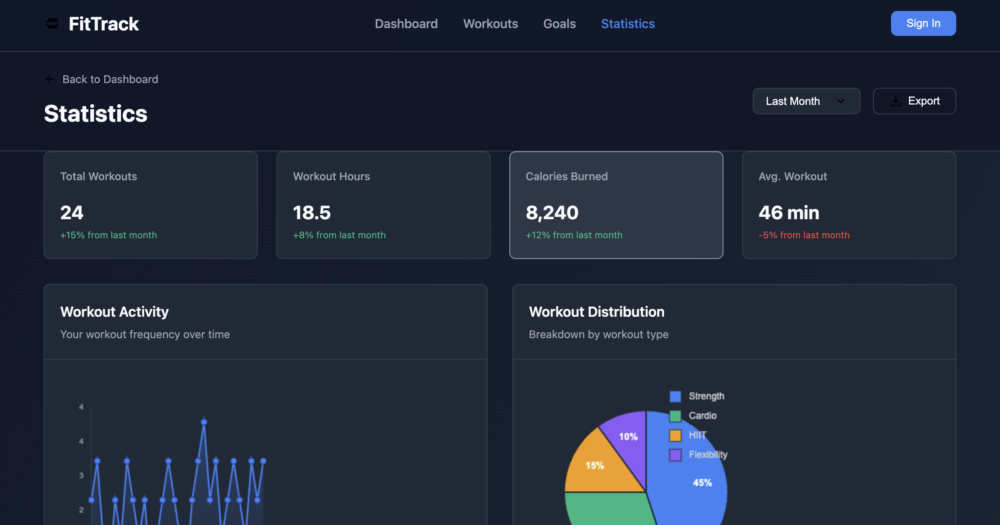
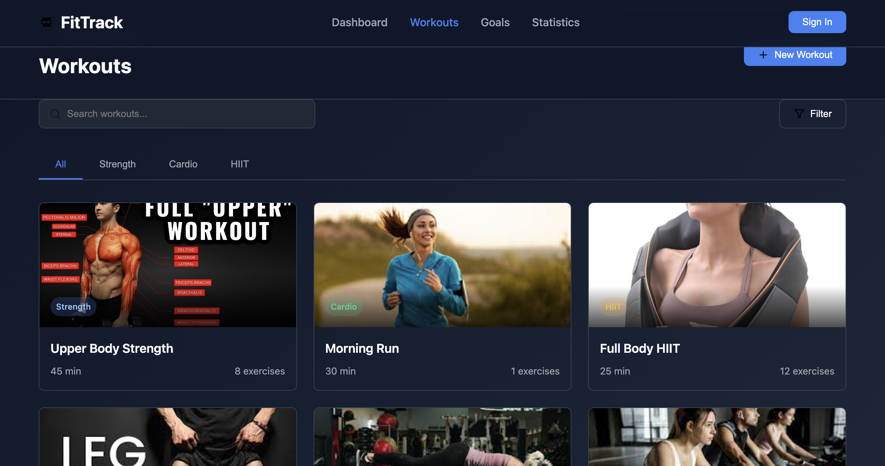

# FitTrack - Fitness Tracker

FitTrack is a web-based fitness tracking application designed to help users monitor their workouts, set fitness goals, and visualize their progress. With an intuitive interface and interactive features, FitTrack makes it easy to stay on top of your fitness journey.

---

## 🌐 Live Demo

Check out the live version of the project here: [FitTrack Live Demo](https://fitness-tracker-silk-mu.vercel.app/)

---

## 📸 Screenshots

### Dashboard

### Goals Page

### Statistics Page

### Workout Page

---

## 🌟 Features

- **Dashboard Overview**:  
  Get a quick summary of your fitness progress, including total workouts, active goals, and weekly progress.

- **Workout Tracking**:  
  View and filter your workouts by category (e.g., Strength, Cardio, HIIT). Search for specific workouts and see detailed stats like duration and exercises.

- **Goal Management**:  
  Set fitness goals, track progress, and categorize them (e.g., Strength, Cardio, Nutrition). View active, completed, or all goals in one place.

- **Statistics Visualization**:  
  Analyze your fitness data with interactive charts, including workout activity trends and workout type distribution.

- **Responsive Design**:  
  Fully responsive layout ensures a seamless experience on both desktop and mobile devices.

- **Interactive UI**:  
  Smooth animations, hover effects, and modals enhance the user experience.

---

## 📖 How It Works

1. **Dashboard**:  
   - View an overview of your fitness stats, including total workouts, active goals, and weekly progress.

2. **Workouts**:  
   - Browse your workout history, filter by category, and search for specific sessions.  
   - Add new workouts and view detailed stats for each session.

3. **Goals**:  
   - Set new fitness goals with details like title, description, category, target value, and due date.  
   - Track progress and view active, completed, or all goals.

4. **Statistics**:  
   - Visualize your fitness data with charts showing workout trends and distribution by type.  
   - Switch between time periods (e.g., week, month, year) to analyze your progress.

---

## 🛠️ Technologies Used

- **HTML5**: For structuring the web pages.
- **CSS3**: For styling and creating a responsive design.
- **JavaScript (ES6)**: For interactivity and dynamic content rendering.
- **Canvas API**: For rendering charts and visualizations.

---

## 📂 Project Structure
FitTrack/ ├── index.html # Main dashboard page ├── workouts.html # Workouts page ├── goals.html # Goals page ├── stats.html # Statistics page ├── styles.css # Shared CSS styles ├── script.js # JavaScript for the dashboard ├── workouts.js # JavaScript for the workouts page ├── goals.js # JavaScript for the goals page ├── stats.js # JavaScript for the statistics page └── assets/ # Images and other assets

---

## 🚀 How to Run the Project

1. Clone or download the project files to your local machine.
2. Open the `index.html` file in any modern web browser.
3. Navigate through the pages using the navigation bar to explore the features.

---

## 📈 Future Enhancements

- Add user authentication for personalized fitness tracking.
- Enable data persistence using a backend or local storage.
- Integrate APIs for real-time fitness data (e.g., wearable devices).
- Add a dark mode toggle for better user experience.
- Include a feature to export fitness data as CSV or PDF.

---

## 📝 License

This project is open-source and available under the [MIT License](LICENSE).

---

## 👨‍💻 About the Developer

Hi, I'm Aryan Raj, a passionate web developer with a keen interest in building interactive and user-friendly web applications. Feel free to connect with me on [LinkedIn](#) or check out my other projects on [GitHub](#).

---

## ⭐ Acknowledgments

- **Canvas API**: For enabling interactive charts and visualizations.
- **Unsplash**: For providing beautiful images used in the project.
- **Inspiration**: Derived from modern fitness tracking apps.
